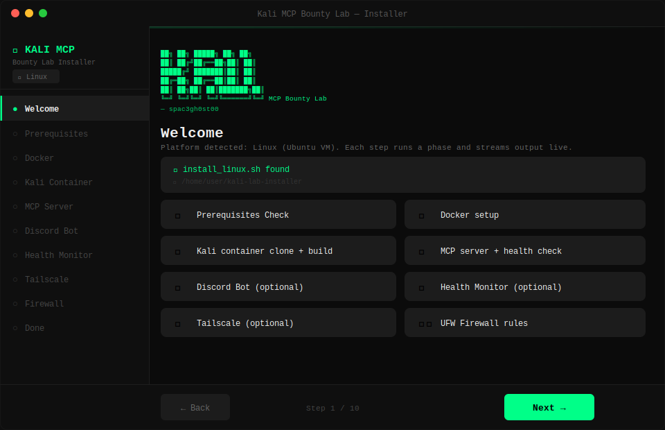

# ⚡ Kali MCP Bounty Lab — Installer

[](https://github.com/spac3gh0st00/Kali-MCP-Bounty-Lab-Installer)
[](https://python.org)
[](https://github.com/TomSchimansky/CustomTkinter)
[](https://github.com/spac3gh0st00/Kali-MCP-Bounty-Lab-Installer/blob/main/LICENSE)
[](https://github.com/spac3gh0st00/Kali-MCP-Bounty-Lab)
[](https://github.com/spac3gh0st00/Kali-MCP-Bounty-Lab)

> **A GUI installer wizard that automates the full setup of [Kali MCP Bounty Lab](https://github.com/spac3gh0st00/Kali-MCP-Bounty-Lab)** — no manual commands required. Double-click and follow the steps.

---

```
 ██╗  ██╗ █████╗ ██╗     ██╗
 ██║ ██╔╝██╔══██╗██║     ██║
 █████╔╝ ███████║██║     ██║
 ██╔═██╗ ██╔══██║██║     ██║
 ██║  ██╗██║  ██║███████╗██║
 ╚═╝  ╚═╝╚═╝  ╚═╝╚══════╝╚═╝  MCP Bounty Lab
                                   — spac3gh0st
```

---

## 🖥️ Preview



---

## 🧭 What Is This?

The [original Kali MCP Bounty Lab](https://github.com/spac3gh0st00/Kali-MCP-Bounty-Lab) is a complete AI-powered security research environment that connects **Claude Desktop** on Windows to a **Kali Linux Docker container** running inside an Ubuntu VM — with a Discord bot, autonomous AI recon agent, and real-time health monitoring.

**This repo is the installer.** Instead of running 30+ manual commands across two operating systems, this GUI wizard:

- Detects whether you're on **Linux (Ubuntu VM)** or **Windows (host)**
- Walks you through each install phase step by step
- Streams live terminal output so you see exactly what's happening
- Writes your `.env` credentials file automatically
- Lets you skip optional components (Discord, Health Monitor, Tailscale)
- Handles dependency checks, error messages, and re-runs gracefully

---

## 🗂️ File Overview

```
Kali-MCP-Bounty-Lab-Installer/
│
├── kali_lab_installer.py   # Cross-platform GUI wizard (customtkinter)
├── install_linux.sh        # Phased bash installer (Ubuntu VM)
├── install_windows.ps1     # Phased PowerShell installer (Windows host)
├── discord_kali_bot.py     # Discord bot — bundled so the Discord phase can copy it in place
├── run.sh                  # Linux launcher — checks deps, then opens GUI
├── run.bat                 # Windows launcher — checks deps, then opens GUI
├── preview.svg             # GUI preview image
└── LICENSE                 # MIT License
```

All files must be in the **same folder**.

---

## 🚀 Quick Start

### Linux (Ubuntu VM inside VMware)

```bash
bash run.sh
```

`run.sh` will auto-install `python3-tk` and `customtkinter` if missing, then open the GUI.

### Windows (Host Machine or VM inside VMware)

```bat
run.bat
```

Double-click `run.bat`. It will auto-install Python 3.12 via `winget` and `customtkinter` via `pip` if missing, then open the GUI.

> **Tip:** For the Port Proxy step on Windows, right-click `run.bat` and choose **Run as administrator** — that step requires elevated privileges.

---

## 🖥️ GUI Walkthrough

The installer detects your OS and shows only the relevant steps.

### Linux Steps (Ubuntu VM)

| Step | What It Does |
|------|-------------|
| **Welcome** | Verifies all installer files are present |
| **Prerequisites** | Scans for `git`, `curl`, `ufw`, `python3-tk` — installs missing items |
| **Docker** | Installs Docker Engine, adds your user to the `docker` group |
| **Kali Container** | Clones `kali-mcp` repo, runs `docker compose build` (~10–20 min first time) |
| **MCP Server** | Starts the container, polls `/health` until it's live |
| **Discord Bot** | Writes `.env` from GUI fields, installs as a `systemd` service |
| **Health Monitor** | Sets up the server health watcher as a `systemd` service |
| **Tailscale** | Installs Tailscale + OpenSSH for remote phone access |
| **Firewall** | Configures UFW — SSH open, port 8000 locked to your Windows host IP |
| **Done** | Summary screen with next steps |

### Windows Steps (Host Machine or VM inside VMware)

| Step | What It Does |
|------|-------------|
| **Welcome** | Verifies all installer files are present |
| **Prerequisites** | Checks for `git`, `Node.js`, `mcp-remote`, Claude Desktop |
| **Claude Desktop** | Writes `kali` MCP entry into `claude_desktop_config.json` |
| **Port Proxy** | Creates `netsh portproxy` rule + Windows Firewall rule |
| **Done** | Summary screen — restart Claude Desktop and test |

---

## ⚙️ What Gets Configured

The installer automates everything documented in the [manual setup guide](https://github.com/spac3gh0st00/Kali-MCP-Bounty-Lab):

- **Docker Engine** — full CE install with compose plugin
- **Kali container** — `kali-mcp` repo clone + image build with 35 security tools
- **MCP server** — verified live via `/health` endpoint
- **`.env` file** — credentials written and `chmod 600` locked automatically
- **Discord Bot** — installed as `discord-kali-bot.service`, starts on boot
- **Health Monitor** — installed as `kalibot-monitor.service`, polls every 10 seconds
- **Tailscale + OpenSSH** — encrypted remote access from phone or any device
- **UFW firewall** — deny-all default, SSH + MCP port scoped to your subnet
- **Windows netsh portproxy** — bridges `localhost:8000` → Ubuntu VM
- **Claude Desktop config** — `mcp-remote` entry written automatically

---

## 📋 Prerequisites

Before running the installer, you need:

| Requirement | Platform | Notes |
|-------------|----------|-------|
| Python 3.10+ | Both | Auto-installed on Windows via `winget` |
| VMware Workstation 17 | Windows | For running the Ubuntu VM |
| Ubuntu 24.04 LTS VM | — | Already running inside VMware |
| Claude Desktop (direct installer) | Windows | [Download](https://claude.ai/download) — **not** the Store version |
| Anthropic API Key | Both | [console.anthropic.com](https://console.anthropic.com) — $5 credit lasts weeks |

Run `run.sh` / `run.bat` first — it handles Python and `customtkinter` automatically.

> **Note:** `discord_kali_bot.py` must be in the same folder as the installer scripts. The Discord phase copies it into place automatically — no manual steps needed.

---

## 🔐 Credentials — Discord Step

When you reach the **Discord Bot** step, the GUI lets you fill in all credentials directly. The installer writes them to `.env` and merges with any existing entries:

```
DISCORD_TOKEN=
DISCORD_GUILD_ID=
ALLOWED_USER_ID=
ANTHROPIC_API_KEY=
DISCORD_WEBHOOK_URL=
MCP_URL=http://localhost:8000
```

Fields left blank are skipped — you can edit `.env` manually later and restart the service.

---

## 🔧 Manual Phase Runs

Every step in the GUI maps to a `--phase` argument. You can run any phase directly from the terminal without the GUI:

```bash
# Linux
bash install_linux.sh --phase prereqs --install-dir ~/kali-mcp --mcp-port 8000
bash install_linux.sh --phase docker
bash install_linux.sh --phase kali --repo-url https://github.com/k3nn3dy-ai/kali-mcp
bash install_linux.sh --phase mcp
bash install_linux.sh --phase discord --discord true
bash install_linux.sh --phase health  --health true
bash install_linux.sh --phase tailscale
bash install_linux.sh --phase firewall --host-ip 192.168.91.1 --ssh-port 22

# Windows (PowerShell)
powershell -ExecutionPolicy Bypass -File install_windows.ps1 -Phase prereqs
powershell -ExecutionPolicy Bypass -File install_windows.ps1 -Phase claude    -VmIp 192.168.91.132 -McpPort 8000
powershell -ExecutionPolicy Bypass -File install_windows.ps1 -Phase portproxy -VmIp 192.168.91.132 -McpPort 8000
```

---

## 🔗 Related

| Resource | Link |
|----------|------|
| Original Lab (manual setup) | [github.com/spac3gh0st00/Kali-MCP-Bounty-Lab](https://github.com/spac3gh0st00/Kali-MCP-Bounty-Lab) |
|BsidesMCPDemo| https://github.com/kannanprabu/BsidesMCPDemo by Kannan Prabu Ramamoorthy — the BSides San Diego workshop demo that inspired OG project
| Kali MCP Server | [github.com/k3nn3dy-ai/kali-mcp](https://github.com/k3nn3dy-ai/kali-mcp) |
| Claude Desktop | [claude.ai/download](https://claude.ai/download) |
| mcp-remote (npm) | [npmjs.com/package/mcp-remote](https://www.npmjs.com/package/mcp-remote) |
| Anthropic API | [console.anthropic.com](https://console.anthropic.com) |

---

## ⚖️ Legal Notice

This installer and the lab it sets up are for **authorised security testing only**.

- Only scan systems you own or have **explicit written permission** to test
- Always verify bug bounty scope before running any tools
- Unauthorised scanning is illegal in most jurisdictions

Hunt legally. Hunt responsibly. 🔐

---

## 📄 License

MIT — see [LICENSE](https://github.com/spac3gh0st00/Kali-MCP-Bounty-Lab-Installer/blob/main/LICENSE)

---

*Built by [spac3gh0st00](https://github.com/spac3gh0st00) — streamlined installer for the Kali MCP Bounty Lab.*
